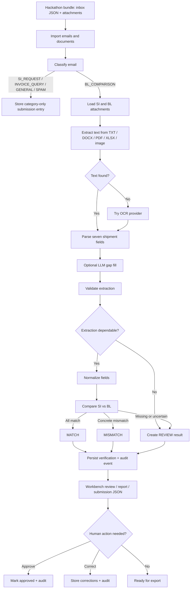

# Veritas for Averis

Veritas is a FastAPI-based shipping document verification system built for the Averis shipping document use case. It turns a mixed operations inbox into clear, auditable outcomes: classify the email, extract shipment fields from SI and BL documents, compare the two documents, route uncertain cases to human review, and produce a submission-ready result.

The name Veritas reflects the goal of the project: verify shipping truth from messy operational documents before a draft Bill of Lading is finalized.

## Problem Statement

Shipping operations teams receive many kinds of messages in the same inbox: SI requests, BL comparison requests, invoice questions, general operations messages, and spam. The most important workflow is the BL comparison request, where a Shipping Instruction (SI) is treated as the reference document and a draft Bill of Lading (BL) must be checked against it.

Manual checking is slow and error-prone because:

- Teams must first identify which emails actually need SI/BL comparison.
- SI and BL files can arrive as TXT, PDF, DOCX, XLSX, or scanned/image-like documents.
- The same field may appear under different labels, such as `Port of Loading`, `Load Port`, or `POL`.
- Names, ports, quantities, and weights may be formatted differently across documents.
- Some documents are missing, unreadable, mislabeled, or incomplete.
- A system that guesses in uncertain cases creates false confidence, while a system that fails silently is not useful for operations.

## Purpose

Veritas is designed to reduce manual review effort while keeping humans in control when automation is uncertain. Its purpose is to:

- Find document-comparison emails in a noisy inbox.
- Extract the seven required shipment fields from SI and BL attachments.
- Compare SI against BL and explain exactly what differs.
- Mark uncertain or incomplete cases as `NEEDS_REVIEW` instead of forcing a fragile decision.
- Preserve a full audit trail for compliance and traceability.
- Generate a submission JSON and downloadable verification report.

## Solution Overview

Veritas implements a full inbox-to-verdict workflow:

1. Import email JSON records and attachment metadata from the hackathon bundle.
2. Classify every email into one of the required categories.
3. For `BL_COMPARISON` emails, extract shipment fields from SI and BL attachments.
4. Validate each extraction for wrong document type, unreadable content, and missing fields.
5. Normalize and compare the SI and BL field values.
6. Persist a verification result: `MATCH`, `MISMATCH`, or `REVIEW`.
7. Allow a reviewer to approve or correct uncertain results.
8. Record audit events and export the official submission shape.

Only BL comparison requests continue to the document verification step. Other categories are classified and included in the submission as category-only results.

## Features

### 1. Inbox Import

- Imports the provided `inbox/*.json` records.
- Registers referenced attachments from `attachments/`.
- Supports reset-and-reimport during development.
- Uses the bundle `loader.py` abstraction through `InboxService`.
- Stores imported emails and documents in SQLite.

Key files:

- `services/input_importer.py`
- `services/inbox_service.py`
- `models/email_message.py`
- `models/document.py`

### 2. Email Classification

Veritas classifies emails into the hackathon categories:

- `BL_COMPARISON`
- `SI_REQUEST`
- `INVOICE_QUERY`
- `GENERAL`
- `SPAM`

Classification supports:

- DeepSeek LLM classification when `DEEPSEEK_API_KEY` is configured.
- Rule fallback when the LLM is unavailable or returns an invalid result.
- Missing-key handling with a visible `missing_ai_key` source.
- Category summary endpoints and a human workbench view.

Key files:

- `services/email_classifier.py`
- `services/llm_service.py`
- `services/classification_schema.py`
- `services/classification_workbench.py`

### 3. Document Extraction

For BL comparison emails, the extraction pipeline reads SI and BL attachments and extracts seven fields:

- `shipper`
- `consignee`
- `notify_party`
- `port_of_loading`
- `port_of_discharge`
- `container_count`
- `gross_weight_kg`

Supported attachment types:

- TXT
- DOCX
- PDF with embedded text
- XLSX
- Image files
- Scanned/image-only PDFs through OCR

Extraction methods include:

- Native text decoding for TXT files.
- Standard-library DOCX XML parsing.
- Standard-library XLSX XML parsing.
- PDF text extraction with `pdfplumber`, `pypdf`, and PyMuPDF fallback.
- OCR fallback when a PDF has no extractable text layer.
- Optional LLM gap filling when rule extraction finds only partial fields.

Key files:

- `services/extraction_service.py`
- `services/document_parser.py`
- `services/document_validator.py`
- `services/ocr_service.py`
- `services/ocr_providers/easyocr_provider.py`
- `services/ocr_providers/openai_provider.py`

### 4. OCR Provider Selection

The OCR layer is configurable through `OCR_PROVIDER`.

Supported providers:

- `easyocr`
- `openai`
- unknown provider -> no-op fallback

The project originally used EasyOCR because it runs locally and is simple to integrate. During testing, EasyOCR was not accurate enough for some messy shipping scans and image-only PDFs. Veritas therefore added an OpenAI OCR provider as a practical tradeoff: it improves OCR accuracy and structure preservation without requiring heavier local OCR stacks such as PaddleOCR, which would increase resource requirements and setup complexity.

This creates a deliberate tradeoff:

- EasyOCR: local, cheaper at runtime, but lower accuracy on messy layouts.
- OpenAI OCR: better for scanned or irregular documents, but requires an API key.
- Larger local OCR stacks such as PaddleOCR: potentially strong, but heavier for hackathon resource constraints.

### 5. Extraction Validation

Every extraction receives a validation status:

- `ok`
- `warning`
- `error`

Validation catches:

- Empty or unreadable text.
- Wrong document types such as invoice, packing list, or certificate of origin.
- Unrecognized layouts where text exists but no shipment fields can be found.
- Missing required fields.
- SI/BL title mismatches as warnings when the content still looks like a shipping document.

Validation does not crash the pipeline. It records structured errors and warnings so the UI, audit trail, and submission output can explain why review is needed.

### 6. SI vs BL Verification

The SI is treated as the source of truth. The BL is compared against it field by field.

Possible verification outcomes:

- `MATCH`: all required fields match.
- `MISMATCH`: at least one concrete field mismatch is detected.
- `REVIEW`: automation cannot make a dependable decision.

The comparison engine records:

- `has_defect`
- `defect_fields`
- `mismatch_details`
- `missing_fields`
- `review_reason`
- `review_details`
- `confidence`
- `verification_hash`

Key files:

- `services/comparison_engine.py`
- `services/field_normalizer.py`
- `services/verification_service.py`

### 7. Human Review

Uncertain cases are routed to review instead of being guessed.

Review supports:

- Approving a result.
- Correcting fields.
- Resetting old reviewer decisions when a fresh extraction changes the verification hash.
- Persisting review status and corrected fields.

Review reasons include:

- Missing SI or BL document.
- Extraction error.
- Missing extracted value.
- Port code/city inconsistency.

### 8. Audit Trail

Veritas writes append-only audit events for classification, extraction, verification, approval, and correction.

The audit trail stores:

- Email metadata.
- Extracted SI and BL field snapshots.
- Normalized comparison values.
- Mismatch details.
- Missing fields.
- Review details.
- Corrected fields.
- Verification hash.
- Process timestamps.

This supports explainability and compliance-style review.

Key files:

- `services/audit_service.py`
- `models/audit_event.py`
- `templates/audit.html`

### 9. Classification Workbench UI

The `/classification` page provides a human workbench for reviewing imported emails.

It includes:

- Category-based email queues.
- Search.
- Email detail panel.
- Attachment/document tiles.
- Extraction status, errors, and warnings.
- Current verification result.
- Review actions.
- Audit history links.
- Report download links.

### 10. PDF Verification Report

For verified emails, Veritas can generate a PDF report containing:

- Email ID, subject, sender, and category.
- Verdict and confidence.
- Reviewer status.
- SI vs BL field comparison.
- Mismatch and missing-field notes.

Key file:

- `services/pdf_report.py`

### 11. Submission Export

Veritas maintains the expected hackathon submission JSON shape.

Endpoints:

- `GET /api/submission`
- `GET /api/submission.json`
- `POST /api/submission/refresh`

For non-BL categories, the payload contains only the category. For BL comparison emails, it contains category, status, defect fields, and review reason.

## Example Email ID

Example: `email_111`

In this sample pair, the SI lists:

- `No. of Containers: 4 x 20'GP`
- `Gross Weight: 91,524 KG`

The BL lists:

- `No. of Containers or Packages: 3 x 20'GP`
- `Gross Weight: 91,524 KG`

Veritas should flag only `container_count` as the defect field because the gross weight and other extracted fields match.

Example submission-style output:

```json
{
  "email_111": {
    "category": "BL_COMPARISON",
    "status": "MISMATCH",
    "review_reason": null,
    "has_defect": true,
    "defect_fields": ["container_count"]
  }
}
```

## Simplified Project Flow



## Tech Stack By Feature

| Feature | Tech stack | Main files |
| --- | --- | --- |
| Web app | FastAPI, Uvicorn, Jinja2 | `app/main.py`, `routers/*`, `templates/*` |
| Database | SQLite, SQLAlchemy ORM | `app/database.py`, `models/*` |
| Config | Pydantic settings, `.env` loader | `app/config.py` |
| Inbox import | Provided `loader.py`, custom importer | `services/input_importer.py`, `services/inbox_service.py` |
| Email classification | DeepSeek chat API, rule fallback | `services/email_classifier.py`, `services/llm_service.py` |
| Text extraction | Python stdlib ZIP/XML parsing, pdfplumber, pypdf, PyMuPDF | `services/document_parser.py` |
| OCR | EasyOCR, OpenAI Responses API vision input, PyMuPDF rendering, Pillow | `services/ocr_service.py`, `services/ocr_providers/*` |
| Field parsing | Regex labels, field aliases, numeric parsing | `services/document_parser.py`, `services/field_normalizer.py` |
| Validation | Custom validation rules | `services/document_validator.py` |
| SI/BL comparison | Normalization, fuzzy matching, LOCODE checks, numeric tolerance | `services/comparison_engine.py`, `services/field_normalizer.py` |
| Human review | FastAPI endpoints, SQLAlchemy persistence | `services/verification_service.py`, `routers/api.py` |
| Audit trail | Append-only audit event model | `services/audit_service.py`, `models/audit_event.py` |
| PDF report | ReportLab | `services/pdf_report.py` |
| Submission export | JSON serialization service | `services/submission_service.py` |
| Tests | `unittest`, in-memory SQLite | `tests/*` |

## BL Comparison Edge Cases Handled

### Email and document availability

- Email classified as non-BL category does not enter the SI/BL verification pipeline.
- Missing SI document creates `REVIEW` with `missing_document`.
- Missing BL document creates `REVIEW` with `missing_document`.
- Pending batch verification can skip already verified emails.
- All-mode batch verification can rerun every BL comparison email.

### File and extraction failures

- Attachment bytes missing or unreadable returns a controlled extraction result instead of crashing.
- Empty extracted text creates `empty_text`.
- PDF extraction tries multiple text backends before OCR.
- OCR provider unavailable returns empty text and routes the case through validation.
- Unknown OCR provider uses a no-op provider.
- OpenAI OCR API failure returns empty text instead of breaking the pipeline.
- Image-only PDF pages are rendered before OCR.
- Multi-page OCR output preserves page markers.

### Wrong or confusing document types

- Invoices are detected as wrong document type.
- Packing lists are detected as wrong document type.
- Certificates of origin are detected as wrong document type.
- SI/BL title mismatches are warnings, not automatic errors, because shipping documents often use titles interchangeably.
- Invoice text containing phrases like "not a shipping instruction" is protected by checking invoice markers first.
- "Bill of Lading Instruction" is treated as SI, not BL.

### Messy labels and layouts

- Field labels with alternate names are recognized.
- `Port of Loading`, `Load Port`, and `POL` map to the same field.
- `Port of Discharge`, `Discharge Port`, and `POD` map to the same field.
- `Notify` and `Notify Party` map to `notify_party`.
- `To the Order of` maps to consignee.
- Label-only layouts are supported by reading following lines.
- Multi-line party names and addresses are joined for comparison.
- Parenthetical label decorations are stripped when they are not part of the value.
- XLSX rows are converted into label/value lines.
- DOCX XML is parsed without depending on Microsoft Word.

### Missing and placeholder values

- `None`, blanks, `N/A`, `NA`, `TBD`, `-`, `--`, `?`, and similar placeholder-only values are treated as missing.
- Missing field on either SI or BL routes the comparison to `NEEDS_REVIEW`.
- Unparseable container count routes to `NEEDS_REVIEW`.
- Unparseable gross weight routes to `NEEDS_REVIEW`.
- Text found but no shipment fields recognized creates `unrecognized_layout`.

### Party name comparison

- Case differences are ignored.
- Extra whitespace is collapsed.
- Unicode text is normalized.
- Periods and commas around company suffixes are ignored.
- Common legal suffix synonyms are normalized, such as `Limited` to `LTD`, `Corporation` to `CORP`, and `Company` to `CO`.
- Trailing suffix parentheticals such as `(LLC)` are folded into the party name.
- Non-suffix parentheticals such as `(M)` are preserved.
- Fuzzy matching allows minor formatting differences while rejecting genuinely different parties.

### Port comparison

- LOCODE values are preferred when present.
- City/country text is used when LOCODE is absent.
- Multi-port slash lists such as `RUGAO/NANTONG/SHANGHAI, CHINA` are split into city candidates.
- Country abbreviations such as `US`, `USA`, `UK`, and `UAE` are normalized.
- Known LOCODE-to-city contradictions are flagged for review/mismatch detail.
- Unknown LOCODEs do not create false review flags.
- Different LOCODEs are treated as mismatches.

### Container count comparison

- `1 x 40'HC` style values are parsed.
- Multiple compound quantities are summed, such as `2 x 40'HC + 3 x 20'GP`.
- Parenthetical counts are parsed, such as `TWO (2) CONTAINERS`.
- Leading integer counts are parsed, such as `4 containers`.
- Different SI/BL counts are reported as `container_count` defects.

### Gross weight comparison

- Commas are stripped from numeric values.
- `KG`, `KGS`, and plain numeric values are parsed as kilograms.
- Pounds and lbs are converted to kilograms.
- A 1 kg tolerance is allowed to avoid false alarms from rounding.
- Different parsed weights beyond tolerance are reported as `gross_weight_kg` defects.

### Review and confidence

- Verification confidence is calculated from the number of matched fields out of seven.
- Extraction errors force `REVIEW` with confidence `0.0`.
- Missing documents force `REVIEW` with confidence `0.0`.
- Missing values create `NEEDS_REVIEW` rather than `MISMATCH`.
- Fresh extraction changes reset previous reviewer decisions.
- Verification hashes preserve traceability between source fields and decision.

## Implementation Details

### Application startup

`app/main.py` creates the FastAPI application, mounts static assets, includes routers, creates the upload directory, and initializes the database.

`app/database.py` creates tables and applies lightweight SQLite column migrations so development databases can evolve without being manually dropped each time.

### Data model

Main persisted entities:

- `EmailMessage`: imported email metadata and classification result.
- `Document`: SI/BL attachment metadata.
- `Extraction`: extracted fields, normalized fields, validation status, errors, and warnings.
- `Verification`: SI/BL comparison result, confidence, defects, review status, and hash.
- `AuditEvent`: append-only process and review history.
- `SubmissionEntry`: submission-ready payload by email ID.

### Verification logic

The comparison engine checks exactly seven fields. It does not compare raw strings directly unless no specialized logic exists.

- Party fields use normalized and fuzzy name matching.
- Port fields use LOCODE/city/country parsing.
- Container count is parsed into an integer.
- Gross weight is parsed into kilograms.
- Missing or unparseable values are routed to review.
- Concrete differences become mismatch details with SI and BL values side by side.

### Why `NEEDS_REVIEW` was challenging

The hardest part was deciding when the system should report a true defect versus when it should ask a person to review. Messy shipping documents create many borderline cases:

- A missing value might mean the BL is defective, or it might mean extraction failed.
- A scanned PDF might look complete to a human but produce weak OCR text.
- A port may have the same LOCODE but a contradictory city label.
- An SI and BL may use different labels for the same field.
- A document title may say BL while the content behaves like an SI instruction.
- Some placeholders look like values unless normalized carefully.

Veritas handles this by separating:

- `MISMATCH`: the system has enough evidence that SI and BL disagree.
- `REVIEW`: the system lacks enough reliable evidence to decide.
- `MATCH`: all seven fields are present and match after normalization.

That distinction is important because false defects waste reviewer time, while false matches create operational risk.

### OCR challenge and tradeoff

OCR was another major challenge. The initial EasyOCR approach was useful for local development but not accurate enough for some scanned or messy documents. Some outputs lost labels, line breaks, or table structure, which reduced extraction confidence.

OpenAI OCR was added to improve accuracy and preserve document structure better. The project did not move fully to heavier local OCR solutions such as PaddleOCR because of resource limits and setup complexity. The result is a configurable OCR layer where the user can select the provider based on available resources and accuracy needs.

### Messy format, accuracy, and confidence

The system improves accuracy by combining several safeguards:

- Multiple PDF text extraction backends before OCR.
- Field label aliases.
- Numeric normalization.
- Port LOCODE logic.
- Fuzzy company-name comparison.
- Validation errors and warnings.
- Confidence scoring based on matched fields.
- Human review for uncertainty.

Confidence is not treated as a magic score. It is a practical signal derived from how many required fields could be compared successfully.

## API Reference

### General

- `GET /api/status`

### Import and classification

- `POST /api/import-input-data?reset=true`
- `POST /api/classify-email`
- `POST /api/classify-imported-emails`
- `GET /api/classification-summary`

### Extraction and verification

- `POST /api/extract/{email_id}`
- `POST /api/extract-all`
- `POST /api/verify-bl-comparison`
- `GET /api/verification/{email_id}`
- `POST /api/verification/{email_id}/review`
- `GET /api/verification/{email_id}/report.pdf`

### Submission

- `GET /api/submission`
- `GET /api/submission.json`
- `POST /api/submission/refresh`

### Audit

- `GET /api/audit-events`
- `GET /api/audit-events/{event_id}`

### UI pages

- `GET /`
- `GET /classification`
- `GET /audit`
- `GET /emails`
- `GET /emails/{email_id}`
- `GET /documents`
- `GET /upload`

## Setup

Run from the `Averis_Project` folder.

```powershell
cd Averis_Project
.\.venv\Scripts\python.exe -m pip install -r requirements.txt
.\.venv\Scripts\python.exe -m uvicorn app.main:app --reload
```

Open:

```text
http://127.0.0.1:8000
```

If you are not using the existing virtual environment, create one first:

```powershell
python -m venv .venv
.\.venv\Scripts\python.exe -m pip install -r requirements.txt
```

## Configuration

Settings are loaded from `.env` in the project folder. Real environment variables override `.env` values.

Example:

```env
DEEPSEEK_API_KEY="your-deepseek-key"
OCR_PROVIDER="openai"
OPENAI_API_KEY="your-openai-key"
OPENAI_OCR_MODEL="gpt-5.5"
```

Supported settings:

- `APP_NAME`
- `APP_VERSION`
- `DATABASE_URL`
- `DATA_SOURCE`
- `UPLOAD_DIR`
- `DEEPSEEK_API_KEY`
- `DEEPSEEK_BASE_URL`
- `DEEPSEEK_MODEL`
- `DEEPSEEK_TIMEOUT_SECONDS`
- `OCR_PROVIDER`
- `OCR_LANG`
- `OPENAI_API_KEY`
- `OPENAI_OCR_MODEL`

Default data source:

```text
../
```

The parent bundle contains:

```text
loader.py
inbox/
attachments/
sample_submission.json
```

## Common Commands

Import or reimport bundle data:

```powershell
.\.venv\Scripts\python.exe scripts\import_input_data.py --reset
```

Run tests:

```powershell
.\.venv\Scripts\python.exe -m unittest discover -s tests
```

Compile check:

```powershell
.\.venv\Scripts\python.exe -m compileall app models routers services scripts tests
```

Run the app:

```powershell
.\.venv\Scripts\python.exe -m uvicorn app.main:app --reload
```

## Project Structure

```text
Averis_Project/
|-- app/                 FastAPI setup, config, database
|-- models/              SQLAlchemy ORM models
|-- routers/             API and HTML route handlers
|-- services/            Classification, extraction, comparison, review, audit, reports
|-- services/ocr_providers/
|   |-- easyocr_provider.py
|   `-- openai_provider.py
|-- scripts/             Import helper scripts
|-- static/              CSS, JS, icon assets
|-- templates/           Jinja2 pages
|-- tests/               Unit and integration tests
|-- project_structure.md Detailed developer orientation
|-- requirements.txt
`-- README.md
```

## Known Limitations

- OCR accuracy still depends on scan quality and provider choice.
- LLM-based classification and gap filling require configured API keys.
- The LOCODE table is curated from observed sample data and should be extended for broader production use.
- SQLite is suitable for the MVP and hackathon workflow, but production deployment should use a managed database.
- Some complex table layouts may still require human review.

## Challenges Faced

- Categorizing `NEEDS_REVIEW` correctly was difficult because missing values, bad OCR, wrong documents, and true defects can look similar at first.
- OCR with EasyOCR was not accurate enough for messy scanned documents, especially when labels and values were separated by layout.
- OpenAI OCR improved extraction quality but introduced an API dependency and cost/latency tradeoff.
- Larger OCR options such as PaddleOCR were considered but avoided because of local resource and setup limitations.
- Shipping documents use inconsistent labels, mixed casing, multilingual fragments, table-like formatting, and optional parenthetical codes.
- Avoiding false positives required normalization for company names, ports, container counts, and weights.
- Confidence had to be practical and explainable, so the project uses field-level comparison completeness rather than opaque scoring.
- Keeping the system auditable required snapshotting decisions, hashes, and review actions instead of only storing the latest result.

## Final Outcome

Veritas for Averis delivers an end-to-end verification MVP for the shipping document workflow. It classifies emails, extracts shipment data from multiple file formats, compares SI and BL documents, handles uncertainty through human review, records audit evidence, and exports the required submission format.
