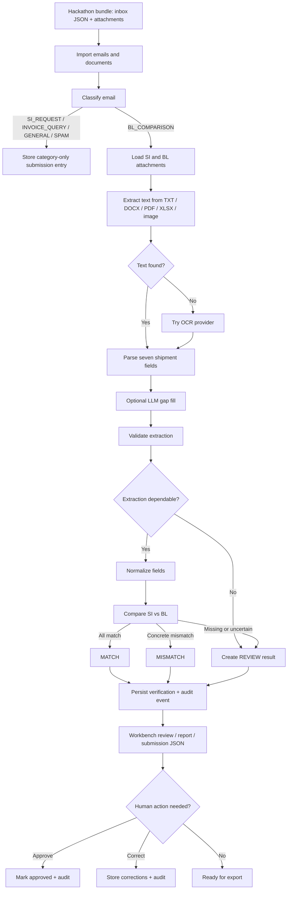

# Veritas for Averis

Veritas is a FastAPI-based shipping document verification system built for the Averis shipping document use case. It turns a mixed operations inbox into clear, auditable outcomes: classify the email, extract shipment fields from SI and BL documents, compare the two documents, route uncertain cases to human review, and produce a submission-ready result.

The name Veritas reflects the goal of the project: verify shipping truth from messy operational documents before a draft Bill of Lading is finalized.

## Table of Contents

- [Problem Statement](#problem-statement)
- [Purpose](#purpose)
- [Solution Overview](#solution-overview)
- [Problem-Solution Alignment](#problem-solution-alignment)
- [Features](#features)
- [Example Email ID](#example-email-id)
- [Simplified Project Flow](#simplified-project-flow)
- [Tech Stack By Feature](#tech-stack-by-feature)
- [AI and Cloud Infrastructure Integration](#ai-and-cloud-infrastructure-integration)
- [BL Comparison Edge Cases Handled](#bl-comparison-edge-cases-handled)
- [Implementation Details](#implementation-details)
- [User Feedback and Testing](#user-feedback-and-testing)
- [Success Metrics](#success-metrics)
- [API Reference](#api-reference)
- [Setup](#setup)
- [Configuration](#configuration)
- [Common Commands](#common-commands)
- [Project Structure](#project-structure)
- [Scalability Plans](#scalability-plans)
- [Known Limitations](#known-limitations)
- [Coding Challenges](#coding-challenges)
- [Final Outcome](#final-outcome)

## Problem Statement

Shipping operations teams receive many kinds of messages in the same inbox: SI requests, BL comparison requests, invoice questions, general operations messages, and spam. The most important workflow is the BL comparison request, where a Shipping Instruction (SI) is treated as the reference document and a draft Bill of Lading (BL) must be checked against it.

Manual checking is slow and error-prone because:

- Teams must first identify which emails actually need SI/BL comparison.
- SI and BL files can arrive as TXT, PDF, DOCX, XLSX, or scanned/image-like documents.
- The same field may appear under different labels, such as `Port of Loading`, `Load Port`, or `POL`.
- Names, ports, quantities, and weights may be formatted differently across documents.
- Some documents are missing, unreadable, mislabeled, or incomplete.
- A system that guesses in uncertain cases creates false confidence, while a system that fails silently is not useful for operations.

## Purpose

Veritas is designed to reduce manual review effort while keeping humans in control when automation is uncertain. Its purpose is to:

- Find document-comparison emails in a noisy inbox.
- Extract the seven required shipment fields from SI and BL attachments.
- Compare SI against BL and explain exactly what differs.
- Mark uncertain or incomplete cases as `NEEDS_REVIEW` instead of forcing a fragile decision.
- Preserve a full audit trail for compliance and traceability.
- Generate a submission JSON and downloadable verification report.

## Solution Overview

Veritas implements a full inbox-to-verdict workflow:

1. Import email JSON records and attachment metadata from the hackathon bundle.
2. Classify every email into one of the required categories.
3. For `BL_COMPARISON` emails, extract shipment fields from SI and BL attachments.
4. Validate each extraction for wrong document type, unreadable content, and missing fields.
5. Normalize and compare the SI and BL field values.
6. Persist a verification result: `MATCH`, `MISMATCH`, or `REVIEW`.
7. Allow a reviewer to approve or correct uncertain results.
8. Record audit events and export the official submission shape.

Only BL comparison requests continue to the document verification step. Other categories are classified and included in the submission as category-only results.

## Problem-Solution Alignment

| Problem in shipping workflow | Veritas solution | Outcome |
| --- | --- | --- |
| Mixed inbox contains comparison requests, SI requests, invoice questions, general messages, and spam. | Email classifier separates messages into the required categories. | Operations staff can focus on the emails that need action. |
| BL comparison requests are easy to overlook. | `BL_COMPARISON` emails are routed into the extraction and verification pipeline automatically. | Every detected comparison request gets a visible status. |
| Manual SI vs BL checking is repetitive. | The system extracts and compares seven required fields. | Reviewers see only the result and any mismatched fields. |
| Shipping documents use inconsistent labels and layouts. | Parser supports aliases, label-only layouts, DOCX/PDF/XLSX/TXT extraction, and OCR fallback. | The same semantic field can be compared even when formatted differently. |
| Some documents are unreadable, missing, or incomplete. | Validation marks uncertain cases as `REVIEW` with structured reasons. | The system escalates instead of guessing. |
| Review decisions need to be traceable. | Verifications include hashes, field snapshots, audit events, and PDF reports. | Decisions can be explained after processing. |
| Hackathon output must follow a specific JSON shape. | Submission service converts internal results into the required output format. | Results can be exported and evaluated consistently. |

## Features

### 1. Inbox Import

- Imports the provided `inbox/*.json` records.
- Registers referenced attachments from `attachments/`.
- Supports reset-and-reimport during development.
- Uses the bundle `loader.py` abstraction through `InboxService`.
- Stores imported emails and documents in SQLite.

### 2. Email Classification

Veritas classifies emails into the hackathon categories:

- `BL_COMPARISON`
- `SI_REQUEST`
- `INVOICE_QUERY`
- `GENERAL`
- `SPAM`

Classification supports:

- DeepSeek LLM classification when `DEEPSEEK_API_KEY` is configured.
- Rule fallback when the LLM is unavailable or returns an invalid result.
- Missing-key handling with rule fallback through a visible `rules_missing_ai_key` source.
- Category summary endpoints and a human workbench view.

### 3. Document Extraction

For BL comparison emails, the extraction pipeline reads SI and BL attachments and extracts seven fields:

- `shipper`
- `consignee`
- `notify_party`
- `port_of_loading`
- `port_of_discharge`
- `container_count`
- `gross_weight_kg`

Supported attachment types:

- TXT
- DOCX
- PDF with embedded text
- XLSX
- Image files
- Scanned/image-only PDFs through OCR

Extraction methods include:

- Native text decoding for TXT files.
- Standard-library DOCX XML parsing.
- Standard-library XLSX XML parsing.
- PDF text extraction with `pdfplumber`, `pypdf`, and PyMuPDF fallback.
- OCR fallback when a PDF has no extractable text layer.
- Optional LLM gap filling when rule extraction finds only partial fields.

### 4. OCR Provider Selection

The OCR layer is configurable through `OCR_PROVIDER`.

Supported providers:

- `easyocr`
- `openai`
- unknown provider -> no-op fallback

The project originally used EasyOCR because it runs locally and is simple to integrate. During testing, EasyOCR was not accurate enough for some messy shipping scans and image-only PDFs. Veritas therefore added an OpenAI OCR provider as a practical tradeoff: it improves OCR accuracy and structure preservation without requiring heavier local OCR stacks such as PaddleOCR, which would increase resource requirements and setup complexity.

This creates a deliberate tradeoff:

- EasyOCR: local, cheaper at runtime, but lower accuracy on messy layouts.
- OpenAI OCR: better for scanned or irregular documents, but requires an API key.
- Larger local OCR stacks such as PaddleOCR: potentially strong, but heavier for hackathon resource constraints.

### 5. Extraction Validation

Every extraction receives a validation status:

- `ok`
- `warning`
- `error`

Validation catches:

- Empty or unreadable text.
- Wrong document types such as invoice, packing list, or certificate of origin.
- Unrecognized layouts where text exists but no shipment fields can be found.
- Missing required fields.
- SI/BL title mismatches as warnings when the content still looks like a shipping document.

Validation does not crash the pipeline. It records structured errors and warnings so the UI, audit trail, and submission output can explain why review is needed.

### 6. SI vs BL Verification

The SI is treated as the source of truth. The BL is compared against it field by field.

Possible verification outcomes:

- `MATCH`: all required fields match.
- `MISMATCH`: at least one concrete field mismatch is detected.
- `REVIEW`: automation cannot make a dependable decision.

The comparison engine records:

- `has_defect`
- `defect_fields`
- `mismatch_details`
- `missing_fields`
- `review_reason`
- `review_details`
- `confidence`
- `verification_hash`

### 7. Human Review

Uncertain cases are routed to review instead of being guessed.

Review supports:

- Approving a result.
- Correcting fields.
- Resetting old reviewer decisions when a fresh extraction changes the verification hash.
- Persisting review status and corrected fields.

Review reasons include:

- Missing SI or BL document.
- Extraction error.
- Missing extracted value.
- Port code/city inconsistency.

### 8. Audit Trail

Veritas writes append-only audit events for classification, extraction, verification, approval, and correction.

The audit trail stores:

- Email metadata.
- Extracted SI and BL field snapshots.
- Normalized comparison values.
- Mismatch details.
- Missing fields.
- Review details.
- Corrected fields.
- Verification hash.
- Process timestamps.

This supports explainability and compliance-style review.

### 9. Classification Workbench UI

The `/classification` page provides a human workbench for reviewing imported emails.

It includes:

- Category-based email queues.
- Search.
- Email detail panel.
- Attachment/document tiles.
- Extraction status, errors, and warnings.
- Current verification result.
- Review actions.
- Audit history links.
- Report download links.

### 10. PDF Verification Report

For verified emails, Veritas can generate a PDF report containing:

- Email ID, subject, sender, and category.
- Verdict and confidence.
- Reviewer status.
- SI vs BL field comparison.
- Mismatch and missing-field notes.

### 11. Submission Export

Veritas maintains the expected hackathon submission JSON shape.

Endpoints:

- `GET /api/submission`
- `GET /api/submission.json`
- `POST /api/submission/refresh`

For non-BL categories, the payload contains only the category. For BL comparison emails, it contains category, status, defect fields, and review reason.

## Example Email ID

Example: `email_111`

In this sample pair, the SI lists:

- `No. of Containers: 4 x 20'GP`
- `Gross Weight: 91,524 KG`

The BL lists:

- `No. of Containers or Packages: 3 x 20'GP`
- `Gross Weight: 91,524 KG`

Veritas should flag only `container_count` as the defect field because the gross weight and other extracted fields match.

Example submission-style output:

```json
{
  "email_111": {
    "category": "BL_COMPARISON",
    "status": "MISMATCH",
    "review_reason": null,
    "has_defect": true,
    "defect_fields": ["container_count"]
  }
}
```

## Simplified Project Flow



## Tech Stack By Feature

| Feature | Tech stack | Main files |
| --- | --- | --- |
| Web app | FastAPI, Uvicorn, Jinja2 | `app/main.py`, `routers/*`, `templates/*` |
| Database | SQLite, SQLAlchemy ORM | `app/database.py`, `models/*` |
| Config | Pydantic settings, `.env` loader | `app/config.py` |
| Inbox import | Provided `loader.py`, custom importer | `services/input_importer.py`, `services/inbox_service.py` |
| Email classification | DeepSeek chat API, rule fallback | `services/email_classifier.py`, `services/llm_service.py` |
| Text extraction | Python stdlib ZIP/XML parsing, pdfplumber, pypdf, PyMuPDF | `services/document_parser.py` |
| OCR | EasyOCR, OpenAI Responses API vision input, PyMuPDF rendering, Pillow | `services/ocr_service.py`, `services/ocr_providers/*` |
| Field parsing | Regex labels, field aliases, numeric parsing | `services/document_parser.py`, `services/field_normalizer.py` |
| Validation | Custom validation rules | `services/document_validator.py` |
| SI/BL comparison | Normalization, fuzzy matching, LOCODE checks, numeric tolerance | `services/comparison_engine.py`, `services/field_normalizer.py` |
| Human review | FastAPI endpoints, SQLAlchemy persistence | `services/verification_service.py`, `routers/api.py` |
| Audit trail | Append-only audit event model | `services/audit_service.py`, `models/audit_event.py` |
| PDF report | ReportLab | `services/pdf_report.py` |
| Submission export | JSON serialization service | `services/submission_service.py` |
| Tests | `unittest`, in-memory SQLite | `tests/*` |

## AI and Cloud Infrastructure Integration

| Layer | Current implementation | Cloud/scaling path |
| --- | --- | --- |
| AI email classification | DeepSeek chat API classifies emails when `DEEPSEEK_API_KEY` is configured, with rule fallback when the API is unavailable. | Move classifier calls behind a queue for retry, rate limiting, and batch processing. |
| AI field extraction support | DeepSeek fills missing shipment fields when rule extraction is incomplete and text is available. | Track model prompts, versions, and confidence metrics for controlled production tuning. |
| OCR | EasyOCR is available for local OCR; OpenAI OCR is available through `OCR_PROVIDER=openai` for higher-accuracy scanned document extraction. | Route large OCR jobs to asynchronous workers and store OCR outputs for reuse. |
| Application backend | FastAPI runs locally with Uvicorn. | Deploy as a containerized API service on Render, Railway, Azure App Service, AWS ECS, or similar. |
| Database | SQLite stores MVP data locally. | Replace `DATABASE_URL` with managed PostgreSQL, such as Supabase Postgres, for concurrent users and persistent cloud data. |
| File storage | Attachments are read from the local bundle and `uploads/`. | Move uploaded SI/BL files to object storage such as Supabase Storage, S3, or Azure Blob Storage. |
| Audit and reports | Audit events are stored in the database; PDF reports are generated on demand. | Persist generated reports in object storage and add retention policies. |
| Configuration | `.env` and environment variables drive API keys, OCR provider, database URL, and model settings. | Use cloud secret managers or platform environment variables for deployment. |

The current project is intentionally MVP-friendly: it works locally, keeps setup simple, and isolates the places that would change for cloud deployment through configuration and service boundaries.

## BL Comparison Edge Cases Handled

| Area | Edge case handled | Example | Result |
| --- | --- | --- | --- |
| Category routing | Non-BL emails do not enter the SI/BL verification pipeline. | `SI_REQUEST`, `INVOICE_QUERY`, `GENERAL`, and `SPAM` emails are classified only. | Category-only submission entry. |
| Missing documents | SI or BL attachment is missing. | An email has only `email_225_BL.txt` or only an SI attachment. | `REVIEW` with `missing_document`. |
| Batch reruns | Already verified emails should not always be reprocessed. | `mode=pending` skips emails that already have a verification row; `mode=all` reruns them. | Avoids duplicate work while still allowing full refresh. |
| Attachment read failure | Attachment bytes are missing, moved, or unreadable. | A referenced file path cannot be loaded from the bundle or project fallback. | Controlled extraction result instead of a crash. |
| Empty extraction | No usable text can be extracted. | Image-only PDF with OCR unavailable. | Extraction error `empty_text`, then `REVIEW`. |
| PDF text fallback | PDF text extraction varies by file. | Text is attempted with `pdfplumber`, `pypdf`, then PyMuPDF before OCR. | More PDFs extract without needing OCR. |
| OCR provider unavailable | Selected OCR provider cannot run. | `OCR_PROVIDER=easyocr` but EasyOCR is not installed, or `OCR_PROVIDER=openai` without a key. | Empty OCR result is handled visibly. |
| OCR API failure | OpenAI OCR request fails. | Network/API failure while reading a scanned document. | Returns empty text and routes through validation. |
| Multi-page scanned PDF | OCR output needs page separation. | A scanned SI or BL with multiple rendered pages. | OCR text is joined with page markers. |
| Wrong document type | Attachment content is not an SI or BL. | Invoice, packing list, or certificate of origin attached under an SI/BL slot. | Extraction error `wrong_document_type`, then `REVIEW`. |
| SI/BL title ambiguity | Shipping documents sometimes use SI and BL titles interchangeably. | Content expected as BL looks like SI, or expected as SI looks like BL. | Warning `document_type_mismatch`, not an automatic hard error. |
| Invoice marker priority | Invoice text may include misleading shipping phrases. | Text says `COMMERCIAL INVOICE` and also contains wording like `not a shipping instruction`. | Detected as invoice first to avoid false SI classification. |
| BL instruction wording | `Bill of Lading Instruction` is not the same as a BL draft. | SI document titled `BILL OF LADING INSTRUCTION`. | Treated as SI. |
| Label aliases | Same field appears under different labels. | In `email_004`, SI uses `POD` and BL also uses `POD`; other cases use `Port of Discharge`. | Values map to `port_of_discharge`. |
| Consignee alias | BL can identify consignee using order wording. | In `email_004`, BL uses `To the Order of: UAB NOVAKOPA`. | Parsed as `consignee`. |
| Notify alias | Notify party label may be shortened. | In `email_004`, SI uses `Notify: EAST BRIGHT FZ-LLC`; BL uses `Notify Party: UAB NOVAKOPA`. | Both map to `notify_party`; mismatch is detected. |
| Label-only layout | Labels and values may be split across lines. | DOCX-style layouts where `Consignee` appears on one line and the company/address starts below. | Parser reads following lines as the value. |
| Multi-line party values | Names and addresses span several lines. | Shipper/consignee blocks with company plus address continuation lines. | Lines are joined for comparison. |
| Parenthetical label decoration | Labels contain notes that are not values. | `Consignee (Non-Negotiable): ...` in `email_004`. | Decoration is ignored; value is extracted. |
| XLSX row format | Spreadsheet fields may be stored as cells rather than text lines. | Label in first column and values in later columns. | Rows are converted to `label: value` lines. |
| DOCX XML format | Word documents should not require Microsoft Word. | `.docx` attachments in the dataset. | Text is extracted through zipped XML. |
| Missing placeholders | Placeholder strings should not compare as real values. | `N/A`, `NA`, `TBD`, `-`, `--`, `?`, blank, or placeholder-like strings. | Treated as missing and routed to `NEEDS_REVIEW`. |
| Partial extraction | One or more required fields are missing after extraction. | SI has a parsed port but BL port is blank. | `NEEDS_REVIEW` with `missing_value`. |
| Unrecognized layout | Text exists but no shipment fields are found. | OCR returns noisy text without recognizable labels. | Extraction error `unrecognized_layout`. |
| Party punctuation | Company suffix punctuation varies. | `Pte. Ltd.` vs `PTE LTD`, or `Co., Ltd` vs `CO LTD`. | Normalized before fuzzy comparison. |
| Legal suffix synonyms | Legal suffix words differ across documents. | `Limited` vs `LTD`, `Corporation` vs `CORP`, `Company` vs `CO`. | Normalized as equivalent. |
| Parenthetical suffixes | Company suffix may appear in parentheses. | `Orient Links Co (LLC)`. | Folded into normalized party name. |
| Non-suffix parentheticals | Some parentheses are part of the real company name. | `April Far East (M) Sdn Bhd`. | Preserved during normalization. |
| Real party mismatch | Consignee or notify party genuinely differs. | `email_004`: SI has `EAST BRIGHT FZ-LLC`; BL has `UAB NOVAKOPA`. | `MISMATCH` with `consignee` and `notify_party` defects. |
| Port LOCODE match | Different display text may still refer to the same port. | Same LOCODE appears on SI and BL. | Treated as matching. |
| Port city/country fallback | LOCODE is absent. | `Rotterdam, Netherlands` style values. | Compares normalized city and country. |
| Multi-port list | Loading port may include a slash-separated routing list. | `RUGAO/NANTONG/SHANGHAI, CHINA`. | Split into city candidates. |
| Country abbreviation | Country may be abbreviated. | `USA`, `US`, `UK`, `UAE`. | Expanded to canonical country names. |
| LOCODE/city contradiction | LOCODE and city text disagree. | `email_128`: `NHAVA SHEVA, INDIA (INNSA)` vs `BUATAN, INDONESIA (INNSA)`. | Mismatch detail includes `locode_city_mismatch`. |
| Unknown LOCODE | Unknown code should not create a false review case. | `CONAKRY, GUINEA (GNCKY)` when not in the curated lookup. | Same unknown LOCODE can still match without false review. |
| Different LOCODEs | Ports have different codes. | `SGSIN` vs `MYPKG`. | Port mismatch. |
| Container quantity format | Container count includes size/type. | `email_004`: `6 x 40'HC` appears as `Total Containers` and `Container Count`. | Parsed as `6`, treated as matching. |
| Multiple container lines | Several container quantities appear in one value. | `2 x 40'HC + 3 x 20'GP`. | Parsed as total `5`. |
| Parenthetical count | Count is written as words plus number. | `TWO (2) CONTAINERS`. | Parsed as `2`. |
| Leading count | Count appears before descriptive text. | `4 containers`. | Parsed as `4`. |
| Container mismatch | SI and BL counts differ. | `email_111`: SI `4 x 20'GP`, BL `3 x 20'GP`. | `MISMATCH` with `container_count`. |
| Weight formatting | Gross weight includes commas or unit variants. | `email_004`: `131,058 KG` appears as `Gross Wt (kgs)` and `Gross Weight (KG)`. | Parsed as `131058.0`, treated as matching. |
| Pounds conversion | Weight is provided in pounds/lbs. | `1000 LBS`. | Converted to kilograms before comparison. |
| Rounding tolerance | Tiny weight differences may be formatting noise. | Values within 1 kg. | Treated as matching. |
| Weight mismatch | Parsed SI and BL weights differ beyond tolerance. | `email_128` includes a gross-weight mismatch. | `MISMATCH` with `gross_weight_kg`. |
| Review confidence | Confidence should reflect how much could be compared. | Missing values reduce comparable field count. | Confidence is based on matched fields out of seven. |
| Fresh extraction after review | Reviewer decisions should not survive changed source data. | Re-extracting changes fields or verification hash. | Reviewer status resets to pending. |
| Audit traceability | Verification should be explainable later. | Every verification stores a hash, source field snapshots, mismatch details, and review details. | Audit trail can reconstruct the decision. |

## Implementation Details

### Application startup

`app/main.py` creates the FastAPI application, mounts static assets, includes routers, creates the upload directory, and initializes the database.

`app/database.py` creates tables and applies lightweight SQLite column migrations so development databases can evolve without being manually dropped each time.

### Data model

Main persisted entities:

- `EmailMessage`: imported email metadata and classification result.
- `Document`: SI/BL attachment metadata.
- `Extraction`: extracted fields, normalized fields, validation status, errors, and warnings.
- `Verification`: SI/BL comparison result, confidence, defects, review status, and hash.
- `AuditEvent`: append-only process and review history.
- `SubmissionEntry`: submission-ready payload by email ID.

### Verification logic

The comparison engine checks exactly seven fields. It does not compare raw strings directly unless no specialized logic exists.

- Party fields use normalized and fuzzy name matching.
- Port fields use LOCODE/city/country parsing.
- Container count is parsed into an integer.
- Gross weight is parsed into kilograms.
- Missing or unparseable values are routed to review.
- Concrete differences become mismatch details with SI and BL values side by side.

### Why `NEEDS_REVIEW` was challenging

The hardest part was deciding when the system should report a true defect versus when it should ask a person to review. Messy shipping documents create many borderline cases:

- A missing value might mean the BL is defective, or it might mean extraction failed.
- A scanned PDF might look complete to a human but produce weak OCR text.
- A port may have the same LOCODE but a contradictory city label.
- An SI and BL may use different labels for the same field.
- A document title may say BL while the content behaves like an SI instruction.
- Some placeholders look like values unless normalized carefully.

Veritas handles this by separating:

- `MISMATCH`: the system has enough evidence that SI and BL disagree.
- `REVIEW`: the system lacks enough reliable evidence to decide.
- `MATCH`: all seven fields are present and match after normalization.

That distinction is important because false defects waste reviewer time, while false matches create operational risk.

### OCR challenge and tradeoff

OCR was another major challenge. The initial EasyOCR approach was useful for local development but not accurate enough for some scanned or messy documents. Some outputs lost labels, line breaks, or table structure, which reduced extraction confidence.

OpenAI OCR was added to improve accuracy and preserve document structure better. The project did not move fully to heavier local OCR solutions such as PaddleOCR because of resource limits and setup complexity. The result is a configurable OCR layer where the user can select the provider based on available resources and accuracy needs.

### Messy format, accuracy, and confidence

The system improves accuracy by combining several safeguards:

- Multiple PDF text extraction backends before OCR.
- Field label aliases.
- Numeric normalization.
- Port LOCODE logic.
- Fuzzy company-name comparison.
- Validation errors and warnings.
- Confidence scoring based on matched fields.
- Human review for uncertainty.

Confidence is not treated as a magic score. It is a practical signal derived from how many required fields could be compared successfully.

## User Feedback and Testing

| Feedback/testing area | What was tested or reviewed | How it improved the project |
| --- | --- | --- |
| Real sample emails | The pipeline was checked against bundled email IDs and SI/BL attachment pairs. | Revealed mismatches like `email_004` party differences and `email_111` container count differences. |
| Classification behavior | Rule classification and LLM fallback behavior are covered by tests. | Reduced risk of routing the wrong email type into BL verification. |
| Field normalization | Party names, ports, container counts, gross weights, placeholder values, and LOCODE cases are covered by unit tests. | Improved accuracy while reducing false mismatches caused by formatting. |
| OCR provider behavior | EasyOCR/OpenAI provider selection and OpenAI OCR failure handling are tested. | Made OCR failure visible and recoverable instead of crashing the pipeline. |
| Submission generation | Submission export is tested for expected JSON shape. | Ensures results remain compatible with the hackathon evaluator format. |
| Human review flow | Review status, corrected fields, verification hashes, and audit events are modeled and persisted. | Keeps uncertain decisions traceable and allows manual correction. |
| UI workflow review | Classification workbench exposes extraction issues, verification status, audit links, and report downloads. | Gives reviewers the context needed to approve or correct edge cases. |

Testing command:

```powershell
.\.venv\Scripts\python.exe -m unittest discover -s tests
```

## Success Metrics

| Metric | Why it matters | How Veritas supports it |
| --- | --- | --- |
| Classification accuracy | Wrong categories cause missed work or unnecessary verification. | Tracks category, confidence, source, and fallback reason. |
| BL comparison precision | False mismatches waste reviewer time. | Uses normalization, tolerances, LOCODE logic, and field-specific comparison. |
| BL comparison recall | Missed defects can cause shipping corrections and delays. | Compares all seven required fields and records defect fields explicitly. |
| Review quality | Uncertain cases should be escalated with useful context. | Stores review reasons, missing fields, extraction errors, and side-by-side values. |
| OCR coverage | Scanned/image-only documents need a readable text path. | Supports EasyOCR and OpenAI OCR provider selection. |
| Processing reliability | Bad inputs should not break the whole batch. | Uses validation statuses and controlled fallbacks. |
| Audit completeness | Decisions must be explainable later. | Creates append-only audit events and verification hashes. |
| Submission readiness | Output must match the expected evaluation format. | Maintains submission entries and downloadable `submission.json`. |

## API Reference

### General

- `GET /api/status`

### Import and classification

- `POST /api/import-input-data?reset=true`
- `POST /api/classify-email`
- `POST /api/classify-imported-emails`
- `GET /api/classification-summary`

### Extraction and verification

- `POST /api/extract/{email_id}`
- `POST /api/extract-all`
- `POST /api/verify-bl-comparison`
- `GET /api/verification/{email_id}`
- `POST /api/verification/{email_id}/review`
- `GET /api/verification/{email_id}/report.pdf`

### Submission

- `GET /api/submission`
- `GET /api/submission.json`
- `POST /api/submission/refresh`

### Audit

- `GET /api/audit-events`
- `GET /api/audit-events/{event_id}`

### UI pages

- `GET /`
- `GET /classification`
- `GET /audit`
- `GET /emails`
- `GET /emails/{email_id}`
- `GET /documents`
- `GET /upload`

## Setup

The project is self-contained inside the `Averis_Project` folder. The inbox data,
attachments, loader, app code, and Docker setup all live here so judges do not
need to move files around after unzipping.

### Required folder layout

```text
Averis_Project/
|-- app/
|-- inbox/
|-- attachments/
|-- loader.py
|-- sample_submission.json
|-- requirements.txt
|-- requirements-docker.txt
|-- Dockerfile
|-- docker-compose.yml
`-- README.md
```

### Docker quick start

Run these commands from the `Averis_Project` folder:

```bash
docker compose up --build
```

Open:

```text
http://localhost:8000
```

After the app opens, import the bundled data by clicking **Import inbox** on the
dashboard. You can also import from the command line:

```bash
docker compose exec averis python scripts/import_input_data.py --reset
```

The container reads:

```text
/app/inbox/
/app/attachments/
/app/loader.py
```

The Docker image uses the OpenAI OCR path by default to keep setup light. Set
`OPENAI_API_KEY` in your shell or local `.env` file if scanned/image-only
documents need OCR. Without API keys, the app still runs with rule-based
classification and non-OCR extraction fallbacks.

### Local Python fallback

If Docker is unavailable, run from the `Averis_Project` folder:

```powershell
python -m venv .venv
.\.venv\Scripts\python.exe -m pip install -r requirements.txt
.\.venv\Scripts\python.exe -m uvicorn app.main:app --reload
```

## Configuration

Settings are loaded from `.env` in the project folder. Real environment variables override `.env` values.

Example:

```env
DEEPSEEK_API_KEY="your-deepseek-key"
OCR_PROVIDER="openai"
OPENAI_API_KEY="your-openai-key"
OPENAI_OCR_MODEL="gpt-5.5"
```

Supported settings:

- `APP_NAME`
- `APP_VERSION`
- `DATABASE_URL`
- `DATA_SOURCE`
- `UPLOAD_DIR`
- `DEEPSEEK_API_KEY`
- `DEEPSEEK_BASE_URL`
- `DEEPSEEK_MODEL`
- `DEEPSEEK_TIMEOUT_SECONDS`
- `OCR_PROVIDER`
- `OCR_LANG`
- `OPENAI_API_KEY`
- `OPENAI_OCR_MODEL`

Default data source:

```text
.
```

The project folder contains:

```text
loader.py
inbox/
attachments/
sample_submission.json
```

Docker overrides `DATA_SOURCE` to `/app`, which is the project folder inside the
container.

## Common Commands

Import or reimport bundle data:

```powershell
.\.venv\Scripts\python.exe scripts\import_input_data.py --reset
```

Run tests:

```powershell
.\.venv\Scripts\python.exe -m unittest discover -s tests
```

Compile check:

```powershell
.\.venv\Scripts\python.exe -m compileall app models routers services scripts tests
```

Run the app:

```powershell
.\.venv\Scripts\python.exe -m uvicorn app.main:app --reload
```

## Project Structure

```text
Averis_Project/
|-- app/                 FastAPI setup, config, database
|-- inbox/               Bundled hackathon email JSON files
|-- attachments/         Bundled SI/BL/email attachment files
|-- models/              SQLAlchemy ORM models
|-- routers/             API and HTML route handlers
|-- services/            Classification, extraction, comparison, review, audit, reports
|-- services/ocr_providers/
|   |-- easyocr_provider.py
|   `-- openai_provider.py
|-- scripts/             Import helper scripts
|-- static/              CSS, JS, icon assets
|-- templates/           Jinja2 pages
|-- tests/               Unit and integration tests
|-- loader.py            Hackathon input loader used by InboxService
|-- sample_submission.json
|-- Dockerfile
|-- docker-compose.yml
|-- requirements-docker.txt
|-- project_structure.md Detailed developer orientation
|-- requirements.txt
`-- README.md
```

## Scalability Plans

| Area | Plan |
| --- | --- |
| Database | Move from SQLite to PostgreSQL through `DATABASE_URL`, with migrations managed by Alembic or a similar migration tool. |
| Background processing | Run import, OCR, extraction, and verification as queued jobs so large inbox batches do not block web requests. |
| File storage | Store uploaded and imported attachments in object storage with stable document IDs. |
| Enterprise ERP integration | Integrate future verification results with enterprise ERP systems so shipment records, customer details, document status, and discrepancy outcomes can sync with existing operational workflows. |
| Email system integration | Connect directly to enterprise email systems in the future, such as Microsoft Outlook, Gmail, or shared operations mailboxes, so Veritas can ingest new messages automatically instead of relying only on static JSON bundle imports. |
| OCR and LLM cost control | Cache extracted text, store model outputs, add retry/backoff, and process only missing or changed documents. |
| Multi-user review | Add reviewer accounts, assignment queues, role permissions, and reviewer comments. |
| Observability | Track processing time, API failures, OCR provider usage, mismatch rates, review rates, and confidence distribution. |
| Evaluation loop | Compare exported submissions against evaluator feedback and maintain a case library of difficult examples. |
| Rule/data expansion | Grow the LOCODE lookup, label aliases, and document class markers as more real shipping documents are reviewed. |

## Known Limitations

- OCR accuracy still depends on scan quality and provider choice.
- LLM-based classification and gap filling require configured API keys.
- The LOCODE table is curated from observed sample data and should be extended for broader production use.
- SQLite is suitable for the MVP and hackathon workflow, but production deployment should use a managed database.
- Some complex table layouts may still require human review.

## Coding Challenges

- Categorizing `NEEDS_REVIEW` correctly was difficult because missing values, bad OCR, wrong documents, and true defects can look similar at first.
- OCR with EasyOCR was not accurate enough for messy scanned documents, especially when labels and values were separated by layout.
- OpenAI OCR improved extraction quality but introduced an API dependency and cost/latency tradeoff.
- Larger OCR options such as PaddleOCR were considered but avoided because of local resource and setup limitations.
- Shipping documents use inconsistent labels, mixed casing, multilingual fragments, table-like formatting, and optional parenthetical codes.
- Avoiding false positives required normalization for company names, ports, container counts, and weights.
- Confidence had to be practical and explainable, so the project uses field-level comparison completeness rather than opaque scoring.
- Keeping the system auditable required snapshotting decisions, hashes, and review actions instead of only storing the latest result.

## Final Outcome

Veritas for Averis delivers an end-to-end verification MVP for the shipping document workflow. It classifies emails, extracts shipment data from multiple file formats, compares SI and BL documents, handles uncertainty through human review, records audit evidence, and exports the required submission format.
